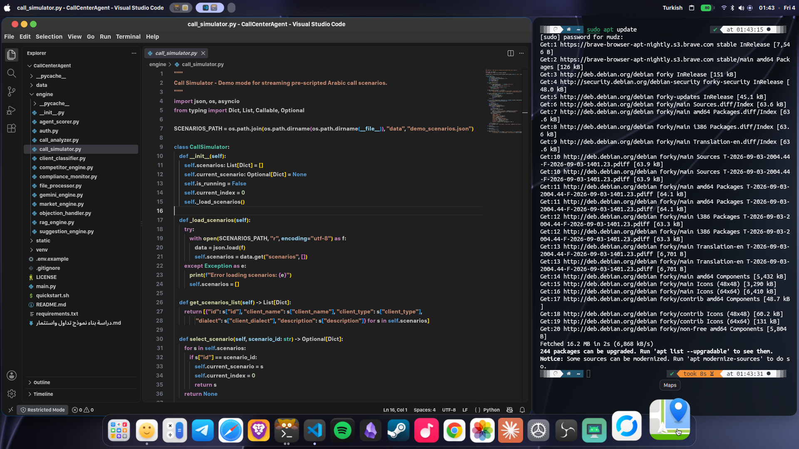
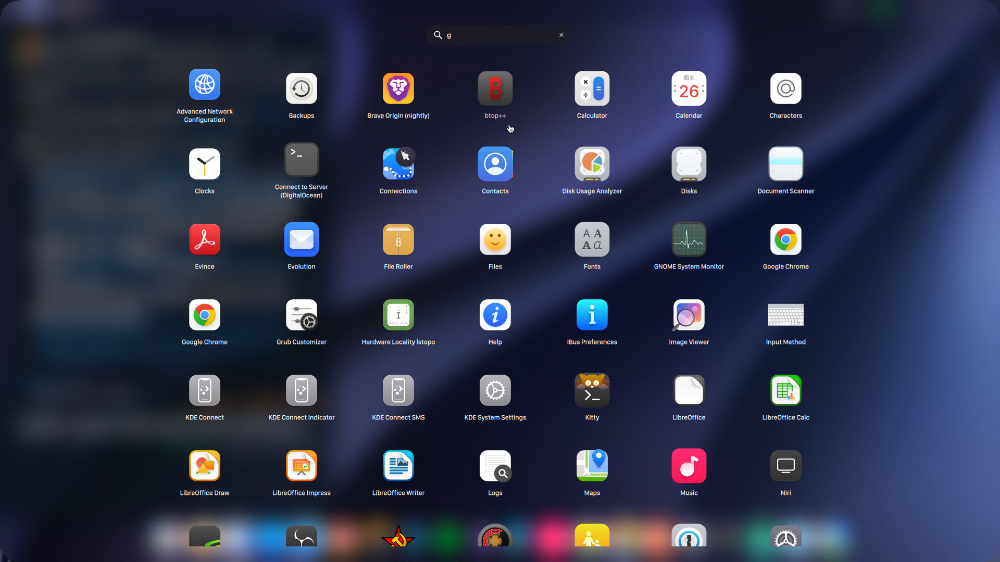
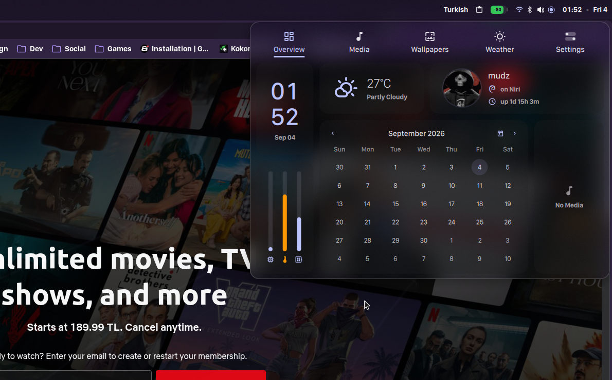
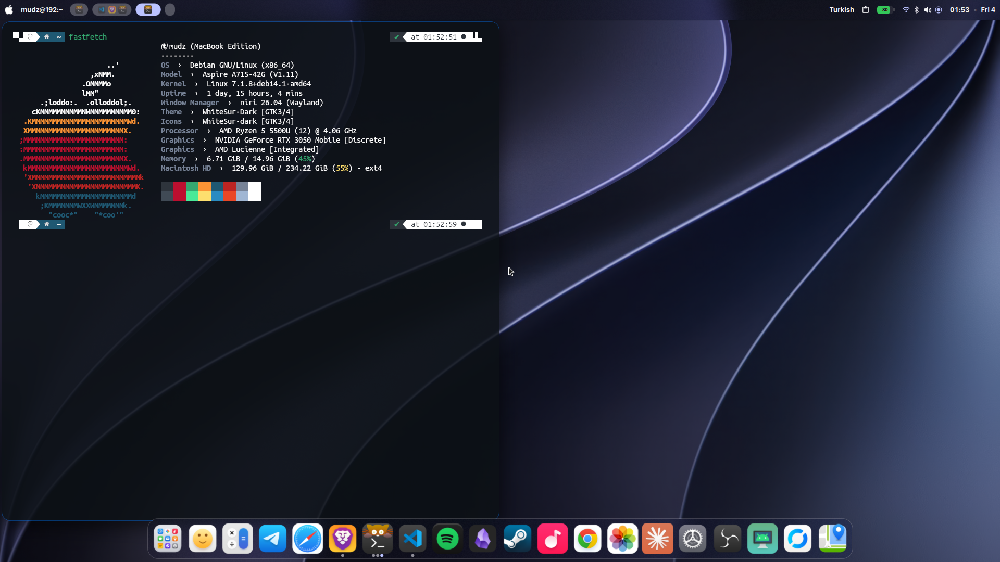
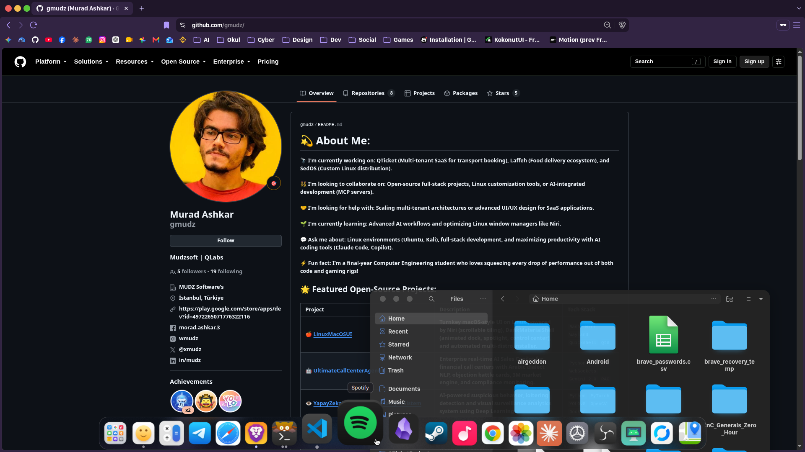
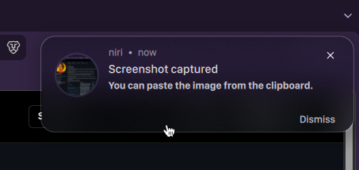

<div align="center">

# 🍎 LinuxMacOSUI

### Transform Your Linux Desktop into a Sleek, Fluid, macOS-Inspired Workstation

### **By MUDZ ("Murad Ashkar")**

[-blueviolet?style=flat&logo=github)](https://github.com/gmudz)

[](https://www.kernel.org/)
[](https://github.com/YaLTeR/niri)
[-FF5722.svg)](https://github.com/AvengeMedia/DankMaterialShell)
[](https://quickshell.org/)
[](LICENSE)
[](#)

*A complete, turnkey desktop environment combining **Niri's** revolutionary scrollable-tiling Wayland window manager with **DankMaterialShell's** macOS-style animated dock, Spotlight search, Launchpad, and Control Center.*

[Overview](#-overview) • [Key Features](#-key-features) • [Quick Install](#-one-click-quick-installation) • [Keybindings](#-keyboard-shortcuts-cheatsheet) • [Architecture](#-architecture--components) • [Customization](#-customization-guide) • [Uninstallation](#-uninstallation--rollback)

---

<p align="center">
  
</p>

</div>

## 📸 Visual Showcase

<div align="center">

### 🚀 macOS Launchpad & 🎛️ Control Center Dashboard
<p align="center">
  
  
</p>

### 💻 Fastfetch Terminal & 🌐 Multitasking Workflow
<p align="center">
  
  
</p>

### 🔔 Native Rounded Notification Toast
<p align="center">
  
</p>

</div>

---

## 🌟 Overview

**LinuxMacOSUI** is a fully configured, battery-included desktop setup that gives you the visual refinement, smooth gestures, and ergonomics of macOS, combined with the blazing performance, infinite scrollable tiling, and freedom of Linux.

### Why this setup?
- **Smooth Animated Dock**: True macOS-style dock with 185% hover magnification, running indicators, and launchpad integration.
- **Spotlight Search**: Instant fuzzy file and application searching (`Alt+Space` or `Ctrl+Space`) powered by `dsearch`.
- **macOS Launchpad & Control Center**: Full-screen application grid and unified system settings drawer (Wi-Fi, Bluetooth, Audio, Dark Mode).
- **Revolutionary Window Tiling**: Powered by **Niri** — an infinite horizontal ribbon of windows, eliminating the claustrophobia of traditional grid tiling.
- **Material You Dynamic Theming**: Colors automatically adapt to your desktop wallpaper via **Matugen** and **dgop**.

---

## ⚡ Key Features

### 🚀 1. macOS-Style Animated Bottom Dock
- **Hover Magnification**: Dynamically scales icons up to **185%** with smooth parabolic easing as your cursor sweeps across.
- **Tiling Strut Guard**: Automatically reserves 76px at the bottom of the screen (`layout.kdl`), ensuring tiled windows never obstruct the dock.
- **Visual Indicators**: Circular glowing indicators for active and running apps.
- **Dedicated Launchpad Rocket**: Vector `macos-launchpad.svg` launcher built right into the dock.

### 🔍 2. Spotlight-Style Deep Search (`dsearch`)
- Supercharged launcher daemon running in the background via systemd.
- Instantly launches apps, navigates directories, and calculates math expressions.
- Triggered anywhere via `Alt+Space`, `Ctrl+Space`, or `Mod+D`.

### 📱 3. Launchpad Application Grid (`Mod + A`)
- Fullscreen macOS-style application drawer with categorized icons and search-as-you-type.

### 🎛️ 4. Unified Control Center (`Mod + Shift + C`)
- macOS Big Sur/Sonoma-inspired control center with toggles for:
  - Wi-Fi network selection
  - Bluetooth device manager
  - Audio output sink & volume slider
  - Display brightness
  - Dark / Light Mode switcher
  - Power profiles & System shutdown

### 📊 5. Desktop Widgets & Specialized Plugins
- **System Monitor Plus**: Circular gauges for CPU usage, CPU temp, RAM usage, and GPU metrics.
- **Cava Audio Spectrum Visualizer**: Dynamic visualizer synced to your audio output.
- **Desktop Weather Widget**: Real-time forecast with weather condition glyphs.
- **Interactive Keybinding Cheat Sheet**: Built-in hotkey overlay accessible on the desktop.

### 🔒 6. Seamless Lock Screen & Blur
- Elegant lock screen with background wallpaper Gaussian blur, media controls, and PAM integration.

### 💻 7. Modern Terminal Setup
- Custom **Kitty** and **Alacritty** themes (`dank-theme.conf`, `dank-tabs.conf`).
- Pre-configured **Fastfetch** banner displaying hardware and desktop specifications.
- Bundled **WhiteSur** macOS cursor theme.

---

## 🚀 One-Click Quick Installation

Run the automated installer directly in your terminal:

```bash
git clone https://github.com/gmudz/LinuxMacOSUI.git
cd LinuxMacOSUI
chmod +x install.sh
./install.sh
```

### Supported Distributions
- **Debian 12/13 / Ubuntu 24.04+ / Linux Mint / Pop!_OS**
- **Arch Linux / Manjaro / EndeavourOS** (via `pacman` & `yay`/`paru`)
- **Fedora 39/40+**

### What the installer does:
1. Automatically detects your package manager and installs all necessary dependencies (`niri`, `quickshell`, `matugen`, `dgop`, `danksearch`, `kitty`, `swaybg`).
2. Downloads and sets up the latest DankMaterialShell QML engine.
3. **Creates a timestamped backup** of any existing configurations in `~/.config/backup_before_niri_<timestamp>/`.
4. Deploys the macOS-style dock, themes, wallpapers, and WhiteSur cursors.
5. Enables user background services (`dms.service`, `dsearch.service`).
6. Registers the `Niri` session in `/usr/share/wayland-sessions/` for your login display manager (GDM, SDDM, greetd).

---

## ⌨️ Keyboard Shortcuts Cheatsheet

| Shortcut | Action | Description |
| :--- | :--- | :--- |
| **`Super + Return`** / **`Super + T`** | 📟 Launch Terminal | Opens Kitty with macOS Dank theme |
| **`Ctrl + Space`** / **`Alt + Space`** / **`Mod + D`** | 🔍 Spotlight Search | Opens DankSearch fuzzy app & file launcher |
| **`Mod + A`** / *(Dock Rocket Icon)* | 🚀 Launchpad | Toggles macOS fullscreen application grid |
| **`Mod + Shift + C`** | 🎛️ Control Center | Opens Quick Settings (Wi-Fi, Bluetooth, Audio, Power) |
| **`Mod + Shift + N`** | 🔔 Notification Center | Opens notification drawer & history |
| **`Mod + Shift + ,`** | ⚙️ DMS Settings | Opens GUI settings (Theme, Dock, Blur, Widgets) |
| **`Super + Left`** / **`Right`** | ↔️ Scroll Workspace | Smoothly scrolls the horizontal window ribbon |
| **`Super + Shift + Left`** / **`Right`** | 🔀 Move Window | Moves active window column left or right |
| **`Super + Up`** / **`Down`** | ↕️ Window Column | Moves focus between windows in the same column |
| **`Super + F`** | 🔲 Maximize / Fullscreen | Expands window to full workspace width |
| **`Super + Shift + Q`** | ❌ Close Window | Closes focused window |
| **`Super + Shift + S`** | 📸 Screenshot | Interactive area screenshot tool |
| **`Volume / Brightness Keys`** | 🔊 / 🔆 Hardware Controls | Adjusts audio sink and backlight with HUD feedback |

---

## 🏛️ Architecture & Components

```
                               ┌───────────────────────────┐
                               │       Display Manager     │
                               │    (GDM / SDDM / greetd)  │
                               └─────────────┬─────────────┘
                                             │ Launches /usr/share/wayland-sessions/niri.desktop
                                             ▼
┌─────────────────────────────────────────────────────────────────────────────────────────────┐
│                                 Niri Wayland Compositor                                     │
│                                (~/.config/niri/config.kdl)                                  │
│                                                                                             │
│  Top Strut: 38px (Top Bar Reserved)        │   Bottom Strut: 76px (Dock Reserved)           │
│  Horizontal Scrollable Window Columns      │   Border Radius: 16px, Focus Rings             │
└────────────────────────────────────────────┬────────────────────────────────────────────────┘
                                             │
                       ┌─────────────────────┴─────────────────────┐
                       │                                           │
                       ▼                                           ▼
┌──────────────────────────────────────────────┐   ┌──────────────────────────────────────────┐
│         DankMaterialShell Daemon             │   │             DankSearch Daemon            │
│                 (dms.service)                │   │             (dsearch.service)            │
│                                              │   │                                          │
│  • Animated macOS Bottom Dock (185% Zoom)    │   │  • Spotlight App & File Search           │
│  • Material Design 3 Top Panel & Status      │   │  • Lightning fast indexing (<10ms)       │
│  • Control Center & Quick Toggles            │   │  • IPC Integration with Niri Binds       │
│  • Launchpad Application Drawer              │   └──────────────────────────────────────────┘
│  • Cava Visualizer & System Monitor Gauges   │
│  • Lock Screen with Wallpaper Blur           │
└──────────────────────────────────────────────┘
```

---

## 📂 Repository Structure

```
LinuxMacOSUI/
├── install.sh                       # Universal one-click installer script
├── uninstall.sh                     # Safe uninstaller & rollback tool
├── README.md                        # Documentation & keybindings guide
├── LICENSE                          # Boost Software License
│
├── config/                          # Dotfiles copied to ~/.config/
│   ├── niri/
│   │   ├── config.kdl               # Master Niri compositor config
│   │   └── dms/                     # Injected struts, colors & binds
│   ├── DankMaterialShell/           # DMS Desktop Shell Configuration
│   │   ├── settings.json            # Dock, widgets, themes, lockscreen
│   │   ├── plugin_settings.json     # Cava, Weather, SystemMonitor, CheatSheet
│   │   ├── firefox.css              # Custom browser styling
│   │   └── themes/                  # synthwaveElectric & custom themes
│   ├── danksearch/                  # Spotlight search configuration
│   ├── dgop/                        # Matugen dynamic color templates
│   ├── kitty/                       # Kitty terminal configuration
│   ├── alacritty/                   # Alacritty configuration
│   └── fastfetch/                   # Terminal info banner
│
├── systemd/                         # Systemd user services (dms, dsearch)
├── bin/                             # Helper scripts (dms-runner, macos-screenshot)
├── session/                         # Wayland session files (niri.desktop, niri-session)
└── assets/                          # WhiteSur cursors, macOS icons, and wallpapers
```

---

## 🎨 Customization Guide

### 1. Changing the Wallpaper & Auto-Theming
LinuxMacOSUI uses **Matugen** to automatically generate a matching Material You color palette from your wallpaper:
1. Open DMS Settings via **`Mod + Shift + ,`**.
2. Navigate to **Wallpaper** and select your desired image (or place it in `~/.local/share/wallpapers/`).
3. The shell, dock, borders, and terminal will re-color dynamically to complement the new wallpaper!

### 2. Adjusting Dock Settings
Open **`Mod + Shift + ,`** and click **Dock**:
- **Enlarge on Hover**: Toggle magnification on or off.
- **Zoom Percentage**: Adjust the scale percentage (default: `185%`).
- **Autohide**: Enable smart autohide if you prefer full-screen immersion.
- **Position**: Change dock placement (Bottom, Left, Right).

### 3. Keyboard Layouts
To add or change keyboard layouts, edit `~/.config/niri/config.kdl`:
```kdl
input {
    keyboard {
        xkb {
            layout "us,tr,ara"
            options "grp:alt_shift_toggle"
        }
    }
}
```
Niri reloads changes instantly upon saving.

---

## 🗑️ Uninstallation / Rollback

If you ever wish to restore your original setup, simply run:

```bash
cd LinuxMacOSUI
./uninstall.sh
```

The script will disable the user services and prompt you to restore your configurations from the automatic backup created during installation.

---

## 🤝 Credits & Acknowledgments

- **[YaLTeR / niri](https://github.com/YaLTeR/niri)** — The brilliant scrollable-tiling Wayland compositor.
- **[AvengeMedia / DankMaterialShell](https://github.com/AvengeMedia/DankMaterialShell)** — The Material Design 3 desktop shell and Quickshell widgets.
- **[Outfoxxed / quickshell](https://github.com/outfoxxed/quickshell)** — Flexible QML desktop shell engine.
- **[InioX / matugen](https://github.com/InioX/matugen)** — Material You color generator.
- **[vinceliuice / WhiteSur-cursors](https://github.com/vinceliuice/WhiteSur-cursors)** — macOS cursor theme.

---

<div align="center">
  <sub>Maintained with ❤️ by <a href="https://github.com/gmudz">Murad Ashkar (gmudz)</a></sub>
</div>
